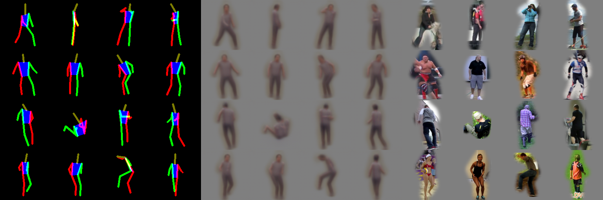

## Generative Modeling of Humans conditioned on Pose

### Usage

#### Data preparation

Get and prepare either
[MPII](http://human-pose.mpi-inf.mpg.de/http://human-pose.mpi-inf.mpg.de/)
or [MSCOCO](http://mscoco.org/http://mscoco.org/) 

For MPII, use

    python prepare_mpii.py --data_dir <dir to MPII> --out_dir <output dir of prepared data>

If the MPII dataset is found in the specified path it will be used,
otherwise it will be downloaded.

For MSCOCO, use

    python prepare_mscoco.py --data_dir <path to MSCOCO annotations> --out_dir <output path of prepared data> --coco_api <path to MSCOCO API>

Only the annotations will be downloaded to the `data_dir`. The images will
be downloaded on the fly. The [MSCOCO Python API](https://github.com/pdollar/coco) is required.

In both cases, `out_dir` will be populated with rectangular crops of size
`256x256`, a mask around the annotated human (a rough one based on the joint
annotations for MPII and a segmentation mask in case of MSCOCO) and an
`index.p` containing a sequential description of images, masks, joint
annotations as well as human-readable joint orderings.

#### Training

To train the model use

    python main.py --data_index <path to prepared index.p>

Output and checkpoints can be found under `log/<date>`. To resume training
from a checkpoint use

    python main.py --data_index <path to prepared index.p> --checkpoint <path to checkpoint>

For more options, look for `argparse` in `main.py`.

#### Testing

To test a trained model on joint annotations use

    python main.py --data_index <path pickled annotations> --checkpoint <path to checkpoint> --mode test

where the pickled annotations must be a dictionary containing the keys
`joints` and `joint_order`. `joints` must a a list of `numpy` arrays of
shape `(n_joints, 2)` describing the `x` and `y` positions of each joint
with respect to an image of size `256` ordered according to `joint_order`.
